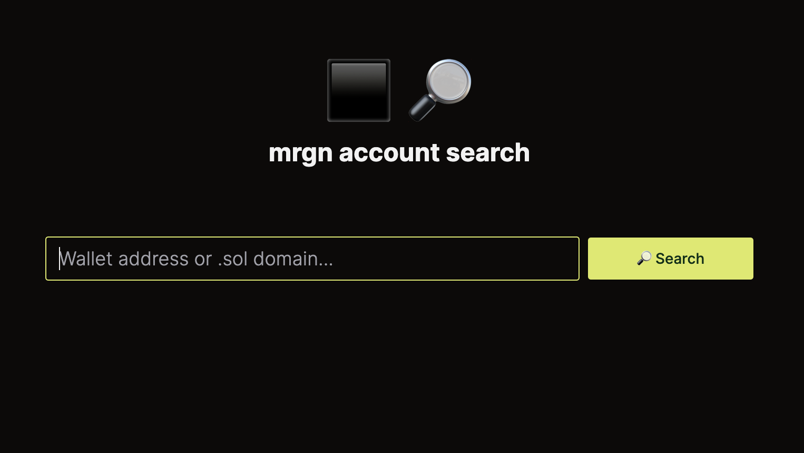

# mrgn account search

A NextJS application to quickly lookup a mrgn account.



## Getting Started

Install dependencies and run development server:

```bash
cp .env.sample .env
# configure env variables

yarn i
yarn dev
```

Open [http://localhost:3000](http://localhost:3000) with your browser to see the result.

## App Router

There is an unresolved issue with the marginfi client and NextJS app router, hence the page router implementation for api routes that interact with the SDK.
